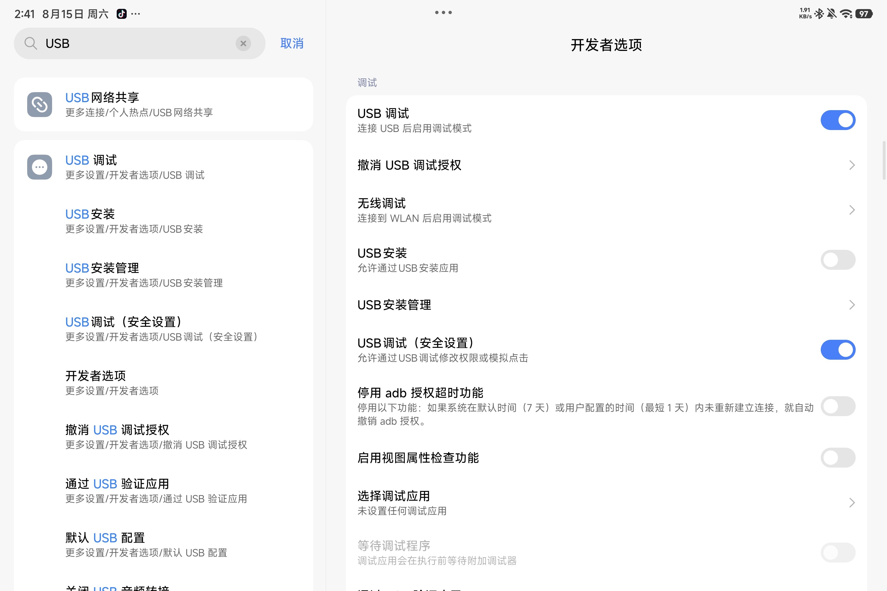
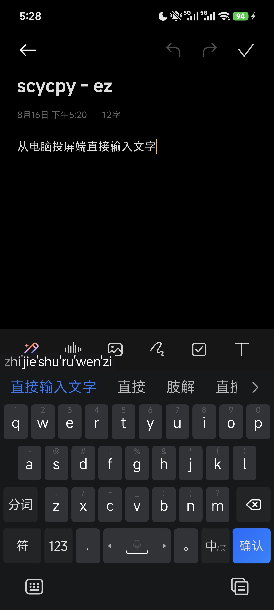
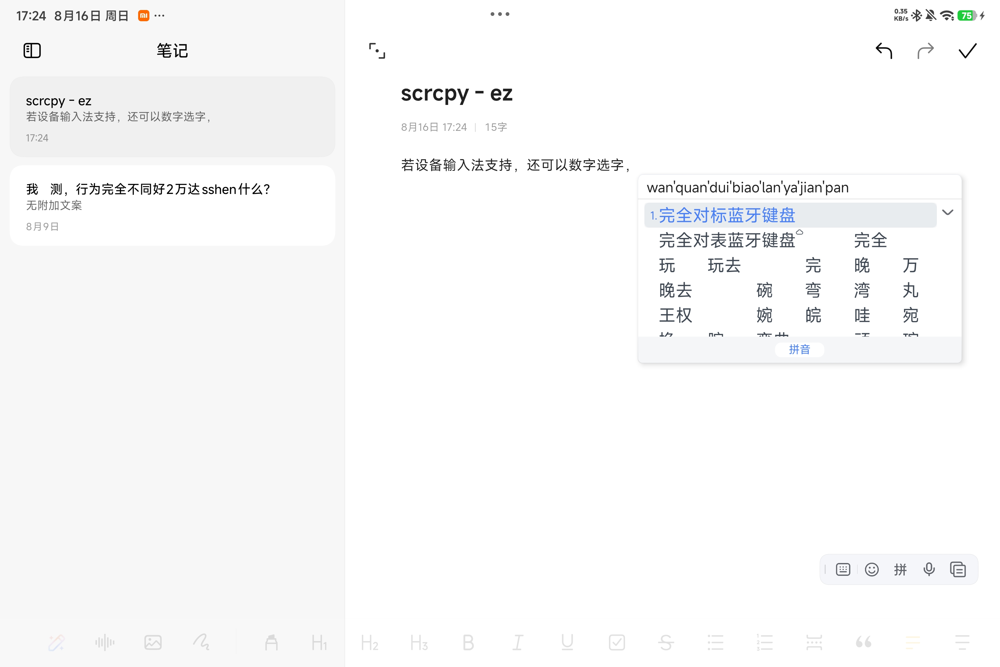
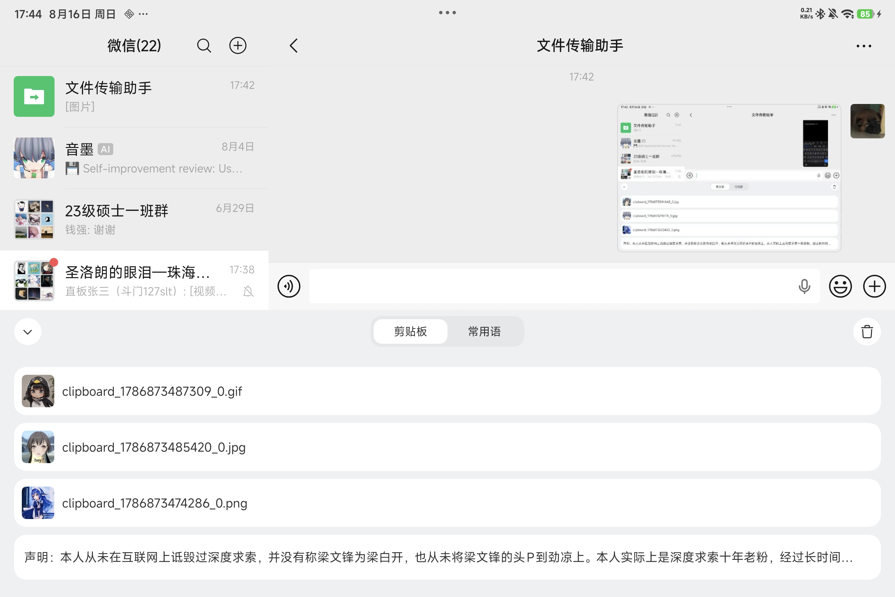
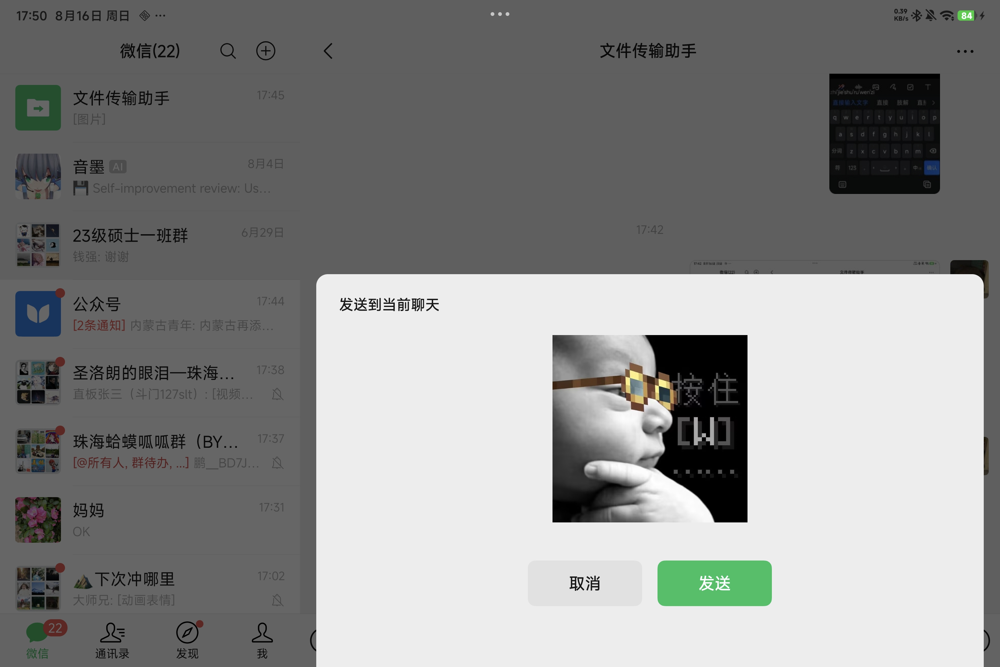
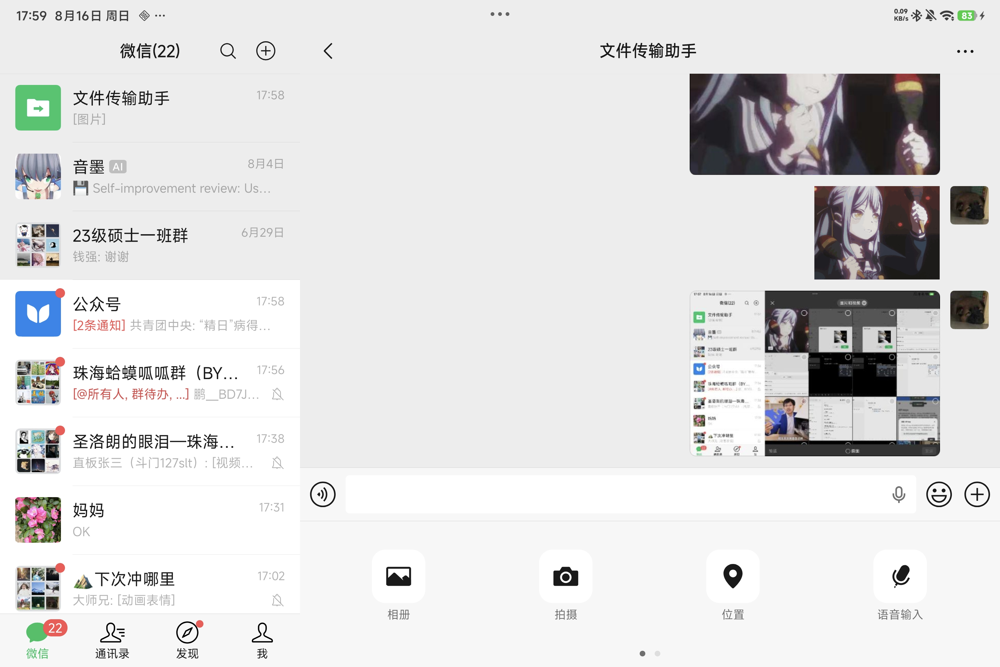

# 🖥️📱 scrcpy-ez — Easy Android Screen Mirroring, Enhanced

> **English | [中文](README.md)**

> An enhanced build based on [scrcpy 4.1](https://github.com/Genymobile/scrcpy) for PC ↔ Android mirroring. **Plug and play, zero hassle.**

> ✨ **Entirely developed by AI** (code and docs written by AI)
> ⚠️ **Tested on**: Windows 11 only (other versions unverified)

---

## 🚀 Quick Start

### First Connection

**Step 1: Enable permissions**

Enter **Developer Mode** on your phone/tablet, enable **USB Debugging**, and allow simulating click actions via USB debugging (e.g. Xiaomi devices also need **USB debugging (Security settings)**).

<p align="center"></p>

**Step 2: Connect**

Connect the PC and device with a USB cable, then run **`投屏启动.bat`**:

- 🔌 **Keep the cable plugged in** → USB mode (higher specs)
- 📡 **Unplug the cable** → automatically switches to wireless mode

### Subsequent Connections

- ✅ Once connected via USB, no cable needed afterwards — on the same LAN, just run `投屏启动.bat` to wirelessly connect to the last device
- 🔄 Hot-plug supported: unplugging/plugging the USB cable automatically restarts and switches between wireless and wired modes
- 💡 Changing devices or networks? Simply connect once via USB as in the first-connection steps

---

## ✨ Key Features

### ⌨️ Keyboard Friendly

Type directly into the mirror window with your PC keyboard — no extra setup.

<p align="center"></p>
<p align="center"></p>

> Note: **Android 13+** required for UHID keyboard; older versions cannot type directly.

### 🖼️ Image Clipboard

Adopts scrcpy PR #6676 — not just text: **images** copied on the PC also enter the device clipboard.

<p align="center"></p>

In apps that support clipboard images, you can **paste and send** (long-press the input field and select Paste / Ctrl+V), e.g. WeChat:

<p align="center"></p>

> Note: Apps may recompress/reformat clipboard images — direct paste may be blurry (GIFs become static). Press **Ctrl+G** to save the image to the device gallery, then send the original from there. (Gallery save works on Android 7.0+, but the clipboard may not show the image.)

<p align="center"></p>

### 🎯 Responsive Picture

**Adaptive bitrate/framerate** keeps the picture responsive (not gaming-grade, not designed for that), greatly reducing wait. Temporary framerate drops and slight blur are **normal** (the system adapts to load).

> Note: Older devices (Android 9 or below) get fixed low refresh rate and bitrate.

### 🎮 Shortcuts

| Shortcut | Function |
|---|---|
| **Ctrl+F** | Toggle the mirror status overlay (drag it with **Alt** held) |
| **Ctrl+G** | Save a copied image from PC to the device gallery |
| **Ctrl+H** | Turn off the device screen during mirroring to save power (the device may enter power-saving mode and limit refresh rate) |
| **Ctrl+T** | Toggle the mirror window always-on-top (or hold **Alt** and click the status lamp on the left of the overlay — same effect) |
| **Alt+F** | Toggle fullscreen |

> 💡 **Pin indicator**: the status lamp on the left of the overlay — orange when pinned, gray otherwise. Hold **Alt** and click the lamp to toggle window pinning (same as **Ctrl+T**); click again to unpin.

<p align="center"></p>

<p align="center"></p>

---

## 📜 Version History

| Version | Highlights |
|---|---|
| **v1.8** | Ctrl+T window always-on-top toggle, glowing status lamp in the overlay (Alt+click the lamp toggles it too) |
| **v1.7** | ABR interaction/idle dual thresholds (video no longer stuck at 1M — relaxed thresholds when idle, sensitive again on interaction), low-bitrate protection |
| **v1.6** | ABR delay baseline re-zero (negative pollution fix), single-animation burst detection (tablet stutter fixed), faster bitrate recovery, bat overhaul (mojibake/wizard/shortcuts) |
| **v1.5** | TSF empty-document block (IME never steals keys, apps stay Chinese), legacy device compatibility (Android 9- auto conservative profile) |
| v1.4 | GL full-rate fix (true 120fps), full fps ladder, overlay S-shape + Ctrl+F toggle |
| v1.3.1 | Status overlay (actual/target fps + live bitrate + USB/WIFI) |
| v1.3 | ABR dual-dimension (bitrate+fps), 90fps buffer partner tier |
| v1.2 | uhid keyboard (direct Chinese input), image clipboard sync (PR #6676), Ctrl+G gallery save |
| v1.1 | Mirror loop + USB/WiFi auto switching |
| v1.0 | First enhanced build |

---

## 🛠️ Build (from source)

```bash
# Server (Android):
cd server && export JAVA_HOME=/path/to/jdk17
gradle --no-daemon assembleRelease
# artifact → copy as dist/scrcpy-server

# Client (Windows):
cd build && PATH=/f/msys64/mingw64/bin:$PATH ninja
# artifact → copy as dist/scrcpy.exe
```

---


## 🙏 Acknowledgements

- [scrcpy](https://github.com/Genymobile/scrcpy) (Genymobile) — the foundation of this project, licensed under Apache License 2.0
- [yume-chan's PR #6676 (Support image clipboard)](https://github.com/Genymobile/scrcpy/pull/6676) — the image clipboard feature is adopted from this PR

## 📄 License

Apache License 2.0 (inherited from upstream scrcpy).
